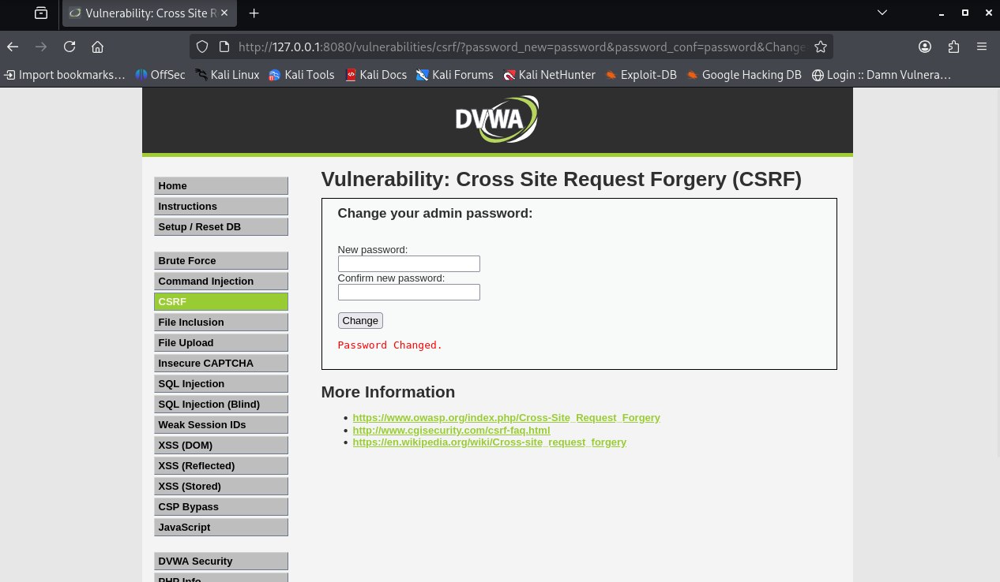
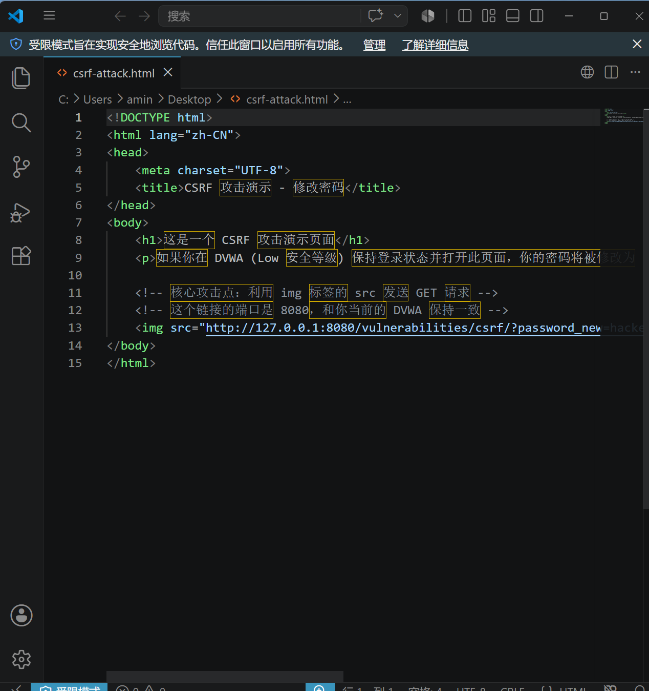
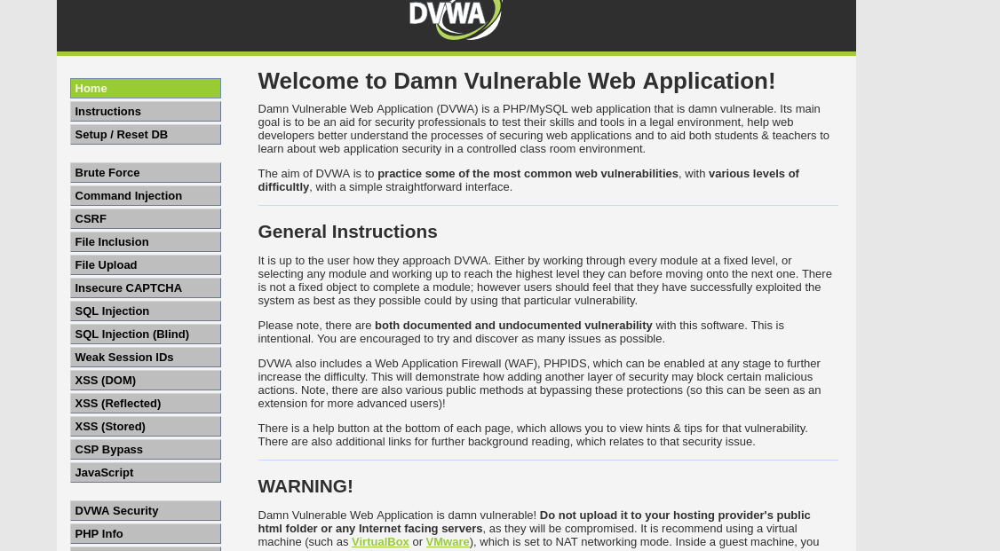

# CSRF 跨站请求伪造漏洞复现与防御分析

## 📌 项目简介
本项目基于 DVWA (Damn Vulnerable Web Application) 靶场，演示了跨站请求伪造（CSRF）漏洞的原理、利用过程，以及如何通过 CSRF Token 进行防御。该演示针对 DVWA 的 `Low` 安全等级，展示了 Web 应用程序若未对关键操作进行 CSRF 保护，攻击者如何利用受害者已登录的 Cookie 悄悄修改密码。

## 🛠 测试环境
- **操作系统**：Kali Linux (虚拟机)
- **Docker 环境**：
  - 镜像：`vulnerables/web-dvwa`
  - 端口映射：`-p 8080:80`
- **浏览器**：Firefox
- **靶场地址**：`http://127.0.0.1:8080`

## 🚀 复现步骤

### 1. 配置 DVWA
首先，使用默认账号 `admin` / `password` 登录 DVWA，点击左侧菜单 **DVWA Security**，将安全等级设为 **Low**，点击 `Submit`。

### 2. 检查 CSRF 漏洞
点击左侧菜单 **CSRF**。该模块允许用户修改密码。输入新密码，点击 `Change` 后，观察浏览器地址栏的 URL，你会发现密码参数是直接在 `GET` 请求中传输的。


*（截图 1：DVWA CSRF 页面，显示 URL 中暴露的参数）*

### 3. 构造恶意 HTML
利用 CSRF 漏洞，我们可以构造一个恶意 HTML 文件（`csrf-attack.html`）。
该文件包含一个隐藏的 `img` 标签，其 `src` 属性指向 DVWA 修改密码的 URL，并预置新密码为 `hacked`。

```html

```


*（截图 2：恶意 HTML 代码内容）*

### 4. 攻击演示
确保浏览器已登录 DVWA，且安全等级为 Low。

1. 在浏览器中打开 `csrf-attack.html` 文件。
2. 页面会自动向 DVWA 发送一个 GET 请求。
3. 此时，DVWA 的登录密码已被悄悄修改为 `hacked`。


*（截图 3：证明密码已被篡改的证据）*

### 5. 验证结果
1. 点击 DVWA 右上角的 **Logout**。
2. 在登录界面，输入用户名 `admin`，密码 `hacked`。
3. 成功登录即代表 CSRF 攻击生效，密码已被成功篡改。

## 🧬 漏洞成因
DVWA Low 安全等级的 CSRF 模块存在以下缺陷：

- **依赖 Cookie 认证**：服务器仅通过 PHPSESSID 判断用户身份。
- **缺乏 CSRF 防护**：修改密码的接口没有校验 CSRF Token，且完全通过 GET 请求传递参数。
- **Same-Origin Policy 绕过**：当一个网站（攻击者）向另一个网站（DVWA）发送请求时，浏览器会自动携带 DVWA 的 Cookie，从而使服务器误以为是用户本人的操作。

## 🛡️ 防御方案
针对 CSRF 漏洞，以下是几种常见的防御措施：

### 1. CSRF Token（最有效的方案）
服务器在生成表单时，会附加一个唯一、随机且不可预测的字符串（Token）。该 Token 与用户会话绑定。当用户提交修改密码请求时，必须携带这个 Token。攻击者无法预测该 Token，因此无法伪造请求。

### 2. 验证码（CAPTCHA）
在修改密码等高危操作前，要求用户输入图形验证码。由于攻击者无法在无人值守的情况下自动完成验证码识别，CSRF 攻击将被阻断。

### 3. Referer 检查
服务器检查 HTTP Referer 头，确保请求来源于本站域名内部。虽然可以通过代码伪造 Referer，但实施难度较高，可作为辅助手段。

### 4. 使用 POST 请求代替 GET
将敏感操作改为 POST 请求并不能完全防御 CSRF（攻击者仍可通过构造自动提交的 form 表单来绕过），但它增加了攻击者的利用成本，并符合 HTTP 语义规范。

## 📝 个人收获
- **深刻理解 CSRF 的本质**：CSRF 利用的是受害者的 Cookie 和受害者的身份对目标网站发起请求，攻击者无法获取受害者 Cookie，只能利用它。
- **GET vs POST 的误区**：很多人误以为使用 POST 请求就可以防御 CSRF，但实际上攻击者可以构造一个自动提交的表单来绕过这种限制。
- **实战经验**：通过亲手构造 HTML 文件并完成一次完整的跨站请求攻击，深刻理解了 CSRF Token 的必要性。
- **防御思维**：安全的本质在于"验证身份"，而非"识别身份"。敏感操作应要求用户提供额外的凭证（如 Token 或验证码）。

## 🔗 参考链接
- [DVWA 官方文档](https://github.com/digininja/DVWA)
- [OWASP CSRF 防御指南](https://cheatsheetseries.owasp.org/cheatsheets/Cross-Site_Request_Forgery_Prevention_Cheat_Sheet.html)

---

## 📁 项目文件
| 文件 | 说明 |
|------|------|
| `README.md` | 本文档 |
| `csrf-attack.html` | CSRF 攻击演示页面（恶意 HTML） |
| `screenshots/01-csrf-page.png` | CSRF 页面截图 |
| `screenshots/02-csrf-payload.png` | 恶意 HTML 代码截图 |
| `screenshots/03-csrf-success.png` | 攻击成功截图 |
| `screenshots/04-csrf-verify.png` | 验证截图 |
